# Quality Platform Tech Tree

```mermaid
graph TD
    %% ═══════════════════════════════════════════════
    %% LAYER 0: FOUNDATIONS (Already Built)
    %% ═══════════════════════════════════════════════

    subgraph L0["Layer 0: Foundations (Built)"]
        direction LR
        PW["Playwright Migration"]
        TC["Testcontainers<br/>(Postgres, Redis, Gitea,<br/>Kafka, Task Runner)"]
        PERF["Performance Tests<br/>(baseline memory, nightly)"]
        CI["CI Infrastructure<br/>(Blacksmith, caching,<br/>orchestration)"]
        OBS["Observability Stack<br/>(Victoria, Jaeger)"]
        QB1["QBot L1: Ask<br/>(shipped)"]
        BQ["BigQuery QA<br/>Pipelines (live)"]
    end

    %% ═══════════════════════════════════════════════
    %% LAYER 1: ROOT NODES (No deps beyond L0)
    %% ═══════════════════════════════════════════════

    subgraph L1["Layer 1: Root Nodes (Start Now)"]
        B1["🌱 B1: Seed Data<br/>Tooling"]
        A["A: Speed Up Local<br/>Build/Test"]
        F["F: DoD<br/>Enforcement"]
        H["H: Bug Watermark<br/>Rework"]
        E1["E1: Distribute<br/>Security Fixing"]
        JAN["Playwright<br/>Janitor"]
        EV["Evidence.dev<br/>Dashboards"]
        CIF["CI Filter<br/>Action RFC"]
        BSP["Batch Security<br/>Patches"]
    end

    %% ═══════════════════════════════════════════════
    %% LAYER 2: REQUIRES LAYER 1
    %% ═══════════════════════════════════════════════

    subgraph L2["Layer 2: First Unlocks"]
        B2["B2: Staging Env<br/>with Prod Data"]
        HARN["Testcontainer<br/>Harness (generic)"]
        TEAM["Team Registry +<br/>Test Ownership"]
        SEL["Smart Selective<br/>Test Runs"]
        PBENCH["Perf Benchmark<br/>Library (npm)"]
        QB2["QBot L2: Do"]
        VITEST["Jest → Vitest<br/>Migration Analyzer"]
    end

    %% ═══════════════════════════════════════════════
    %% LAYER 3: REQUIRES LAYER 2
    %% ═══════════════════════════════════════════════

    subgraph L3["Layer 3: Core Capabilities"]
        NIGHT["Nightly Smoke/E2E<br/>+ Load Testing"]
        SOAK["🔥 Soak Testing<br/>RFC"]
        MIG["Migration<br/>Testing"]
        MOCK["3P Service<br/>Recording/Mocking"]
        HONEY["Honeycomb E2E<br/>Observability"]
        TRIAGE["Automated Test<br/>Failure Triage"]
        GRIND["THE GRINDER"]
        D1["D1: Nightly<br/>Releases"]
    end

    %% ═══════════════════════════════════════════════
    %% LAYER 4: REQUIRES LAYER 3
    %% ═══════════════════════════════════════════════

    subgraph L4["Layer 4: High-Value Outputs"]
        SIZE["Instance<br/>Sizing Guide"]
        SQLP["SQLite vs Postgres<br/>Comparison"]
        CONT["Contention<br/>Test Suite"]
        PREG["Perf Regression<br/>Detection (load)"]
        WATCH["Release Watchdog<br/>(auto-rollback)"]
        PATCH["Patch Release<br/>Audit"]
        QB3["QBot L3: Watch<br/>(proactive alerts)"]
        AITA["AI Test<br/>Authoring"]
    end

    %% ═══════════════════════════════════════════════
    %% LAYER 5: CONVERGENCE
    %% ═══════════════════════════════════════════════

    subgraph L5["Layer 5: Convergence (Platform Maturity)"]
        SELF["Self-Serve<br/>Test Creation"]
        AUTO["Auto-Triage<br/>Agent"]
        DAST["DAST /<br/>Fuzzing"]
        ENT["Enterprise<br/>Debug Envs"]
    end

    %% ═══════════════════════════════════════════════
    %% EDGES: L0 → L1
    %% ═══════════════════════════════════════════════

    PW --> JAN
    TC --> JAN
    CI --> CIF
    QB1 --> QB2
    BQ --> EV

    %% ═══════════════════════════════════════════════
    %% EDGES: L1 → L2
    %% ═══════════════════════════════════════════════

    B1 --> B2
    A --> SEL
    A --> VITEST
    JAN --> HARN
    JAN --> TEAM
    JAN --> PBENCH

    %% ═══════════════════════════════════════════════
    %% EDGES: L2 → L3
    %% ═══════════════════════════════════════════════

    B2 --> NIGHT
    B2 --> SOAK
    B2 --> MIG
    B2 --> D1
    PERF --> SOAK
    TC --> SOAK
    HARN --> MOCK
    HARN --> HONEY
    TEAM --> TRIAGE
    TC --> GRIND
    CI --> GRIND
    NIGHT --> D1

    %% ═══════════════════════════════════════════════
    %% EDGES: L3 → L4
    %% ═══════════════════════════════════════════════

    SOAK --> SIZE
    SOAK --> SQLP
    SOAK --> CONT
    SOAK --> PREG
    PBENCH --> PREG
    D1 --> WATCH
    HONEY --> WATCH
    D1 --> PATCH
    H --> PATCH
    QB2 --> QB3
    HONEY --> QB3
    HARN --> AITA
    PBENCH --> AITA
    TEAM --> AITA

    %% ═══════════════════════════════════════════════
    %% EDGES: L4 → L5
    %% ═══════════════════════════════════════════════

    AITA --> SELF
    HARN --> SELF
    TEAM --> SELF
    TRIAGE --> AUTO
    QB3 --> AUTO
    HONEY --> AUTO
    E1 --> DAST
    B2 --> DAST
    HARN --> ENT
    HONEY --> ENT
    B2 --> ENT

    %% ═══════════════════════════════════════════════
    %% CROSS-BRANCH UNLOCKS (dashed)
    %% ═══════════════════════════════════════════════

    GRIND -.->|"auto-route<br/>ownership"| TRIAGE
    QB2 -.->|"fix from<br/>Slack"| GRIND
    EV -.->|"dashboards<br/>as code"| QB3
    BQ -.->|"metrics<br/>feed"| QB3

    %% ═══════════════════════════════════════════════
    %% STYLES
    %% ═══════════════════════════════════════════════

    classDef built fill:#2d6a4f,stroke:#1b4332,color:#fff
    classDef active fill:#e76f51,stroke:#c44536,color:#fff
    classDef ready fill:#457b9d,stroke:#1d3557,color:#fff
    classDef idea fill:#6c757d,stroke:#495057,color:#fff
    classDef root fill:#f4a261,stroke:#e76f51,color:#000
    classDef junction fill:#e63946,stroke:#a4161a,color:#fff
    classDef output fill:#a8dadc,stroke:#457b9d,color:#000
    classDef convergence fill:#9d4edd,stroke:#7b2cbf,color:#fff

    class PW,TC,PERF,CI,OBS,QB1,BQ built
    class JAN active
    class B1,A root
    class F,H,E1,CIF,BSP,EV ready
    class B2,HARN,TEAM,SEL,PBENCH,QB2,VITEST idea
    class SOAK junction
    class NIGHT,MIG,MOCK,HONEY,TRIAGE,GRIND,D1 idea
    class SIZE,SQLP,CONT,PREG,WATCH,PATCH,QB3,AITA output
    class SELF,AUTO,DAST,ENT convergence
```

## Legend

| Colour | Meaning |
|---|---|
| 🟢 Dark Green | Built (Layer 0 - already shipped) |
| 🟠 Orange | Root Nodes (highest priority - start now) |
| 🔴 Red | Junction Node (Soak Testing RFC - 1 input → 5 outputs) |
| 🔵 Blue | Ready to Build / Process Changes |
| ⚪ Grey | Ideas (unlocked by earlier layers) |
| 🔵 Light Blue | High-Value Outputs (Layer 4) |
| 🟣 Purple | Convergence (platform maturity) |
| ── Solid line | Direct dependency |
| -- Dashed line | Cross-branch unlock |

## Key Takeaways

1. **Seed Data Tooling (B1)** is the single highest-value root node — almost everything flows through it
2. **Soak Testing RFC** is the biggest junction — 1 project producing 5 Layer 4 outputs
3. **Playwright Janitor** (active) unlocks 3 Layer 2 items (Harness, Team Registry, Perf Benchmark Library)
4. **QBot** has a parallel track (L1→L2→L3) that converges with testing at Layer 4
5. **Cross-branch unlocks** (dashed) show compounding value across hats (QA + DevEx + Security)
6. **Layer 5** is where the "platform needs users" argument for junior SDET hire becomes concrete
