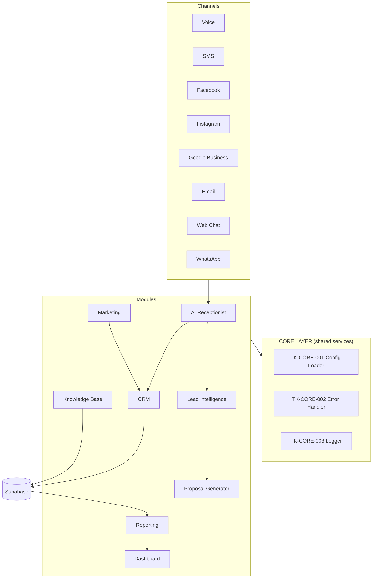

# TK AI Growth OS

**The AI Growth Operating System by TK AI Solutions** — a white-label, multi-tenant, multi-industry platform that helps small businesses make more money using AI.

> Built as a platform, not a project. Every module serves thousands of businesses across 11+ industries in the US, Canada, and Australia.

---

## 1. Business Goal

Small businesses lose revenue every day to missed calls, slow follow-up, empty calendars, and zero marketing. TK AI Growth OS packages sales, marketing, customer service, appointment booking, CRM, and AI reception into one recurring-revenue SaaS platform that:

- **Answers every lead** on every channel (voice, SMS, social, email, web chat, WhatsApp) 24/7
- **Books appointments** automatically and recovers missed calls
- **Runs the CRM** without the owner touching it
- **Reports KPIs** the owner actually cares about (revenue, bookings, conversion)
- **White-labels** so agencies can resell it under their own brand

Revenue model: per-location monthly subscription + usage-based AI credits + white-label agency licensing.

## 2. System Architecture

The OS is a set of small, composable modules. No monolithic workflows — every capability is a versioned sub-workflow invoked through the Core layer.

**Modules** (each = its own folder of workflows + prompts + config):

| Module | Code | Purpose |
|---|---|---|
| Core | `CORE` | Config loading, error handling, logging, retries — shared by everything |
| AI Receptionist | `RCP` | Omnichannel inbound handling, booking, missed-call recovery |
| Lead Intelligence | `LEAD` | Capture, enrichment, scoring, qualification |
| CRM | `CRM` | Contact/customer lifecycle on Supabase |
| Marketing | `MKT` | Campaigns, SMS/email sequences, reviews |
| Proposal Generator | `PROP` | AI-generated audits and proposals |
| Knowledge Base | `KB` | Per-business RAG knowledge for all agents |
| Reporting | `RPT` | KPI aggregation and AI reports |
| Dashboard | `DASH` | SaaS UI surface (API-first) |

**AI Agents** are role-scoped prompt + tool bundles (see `prompts/agent-library.md`): Receptionist, Lead Research, Website Audit, SEO, Sales, Proposal, Knowledge, CRM, Reporting, Marketing.

## 3. Database Schema

Supabase (Postgres) is the single source of truth. Multi-tenant by `company_id` with Row Level Security. Full DDL: [`database/supabase/schema.sql`](database/supabase/schema.sql).

Core tables: `companies`, `locations`, `contacts`, `customers`, `appointments`, `calls`, `messages`, `emails`, `campaigns`, `invoices`, `payments`, `knowledge_base`, `ai_reports`, `workflow_logs`, `vertical_configs`.

## 4. API Design

API-first: everything the dashboard shows, an API serves. See [`docs/api-design.md`](docs/api-design.md).

- n8n webhooks expose `/webhook/tk/v1/...` endpoints (versioned)
- Every endpoint authenticated via `X-TK-API-Key` header mapped to a `company_id`
- Standard envelope: `{ ok, data, error, meta: { request_id, version } }`

## 5. UI Components

Modern SaaS dashboard (Next.js + Supabase recommended), dark/light mode, white-label theming via `config/platform.example.json`:

- Primary `#2DC2C4` · Accent `#FF9501` · Background `#0B2354` (TK default theme — overridable per white-label tenant)
- KPI cards: Today's Leads, Revenue, Bookings, Missed Calls, Conversion Rate, Repeat Customers, Average Ticket, Open Rate, Reply Rate, AI Usage
- Views: Inbox (omnichannel), Calendar, Contacts, Campaigns, Reports, Settings

## 6. AI Prompts

All prompts are **templates with variables** — never hardcoded to one business. Vertical behavior is injected from `config/verticals/*.json` at runtime by the Config Loader. See [`prompts/`](prompts/).

## 7. n8n Workflows

Reusable, versioned templates in [`workflows/`](workflows/). Naming: `TK-<MODULE>-<NNN>__<slug>` (e.g. `TK-RCP-001__omnichannel-inbound-router`). Every workflow follows the contract in [`docs/workflow-standards.md`](docs/workflow-standards.md): purpose, typed input/output, config via environment + Config Loader, error handling, retry logic, logging, webhook + API support, versioning, documentation.

Shipped templates:

| Workflow | Purpose |
|---|---|
| `TK-CORE-001__config-loader` | Resolve company + vertical config for any execution |
| `TK-CORE-002__error-handler` | Global error trigger → log + alert |
| `TK-CORE-003__logger` | Structured execution logging to Supabase |
| `TK-RCP-001__omnichannel-inbound-router` | Normalize any channel → AI Receptionist → intent routing |
| `TK-RCP-002__missed-call-recovery` | Missed call → instant SMS-back → booking flow |
| `TK-CRM-001__contact-upsert` | Idempotent contact create/update service |
| `TK-LEAD-001__lead-capture-qualify` | Capture → enrich → score → route |

## 8. Error Handling

- Every workflow sets `TK-CORE-002__error-handler` as its n8n Error Workflow
- External calls use built-in retry (3 attempts, exponential backoff) + circuit-break flag in config
- Failures are logged to `workflow_logs` with severity, then alerted (Slack/SMS/email per platform config)
- All handlers are idempotent — safe to retry end-to-end

## 9. Future Improvements

- Voice: native telephony agent (Twilio/Telnyx streaming + realtime AI)
- Payments module (Stripe Connect for agency white-label billing)
- Self-serve onboarding wizard that provisions company + vertical config + credentials
- A/B testing engine for campaign copy
- Fine-tuned per-vertical models once volume justifies it
- Marketplace of vertical packs (sell "Med Spa Pack", "Realtor Pack" as add-ons)

## 10. Documentation

- [`docs/architecture.md`](docs/architecture.md) — deep-dive architecture & module contracts
- [`docs/workflow-standards.md`](docs/workflow-standards.md) — the workflow contract every template must meet
- [`docs/verticals.md`](docs/verticals.md) — how industry verticals are configured (no code changes per industry)
- [`docs/api-design.md`](docs/api-design.md) — API conventions & endpoint catalog
- [`database/supabase/schema.sql`](database/supabase/schema.sql) — full DDL with RLS
- [`prompt-library/`](prompt-library/README.md) — the TK Prompt Library: master architect + pre-flight prompts and specialized builder prompts that make every AI-assisted build follow this architecture
