# n8n 多租户架构图和流程图

> **配套文档：** 01-架构底层改造方案.md
> **版本：** v1.0
> **日期：** 2025-11-03

---

## 一、数据库 E-R 关系图

### 1.1 核心实体关系

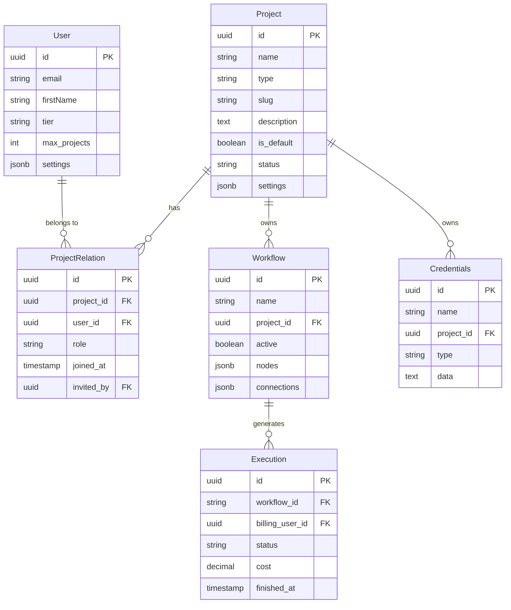

### 1.2 项目类型说明

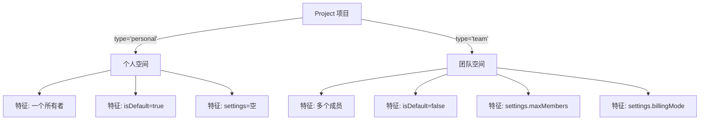

---

## 二、架构对比图

### 2.1 改造前后查询路径对比

**改造前（4层JOIN）：**

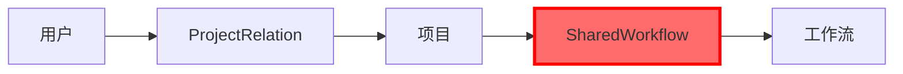

**改造后（3层JOIN）：**

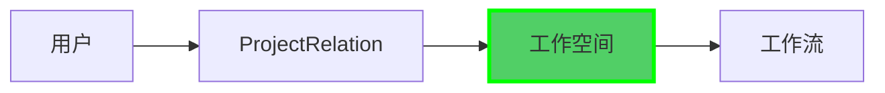

**性能提升：** ~30%

### 2.2 Coze 架构对标

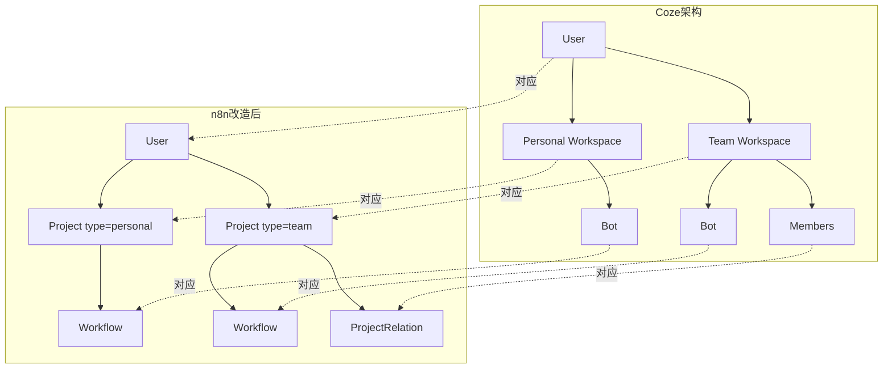

---

## 三、工作空间管理流程

### 3.1 用户注册流程

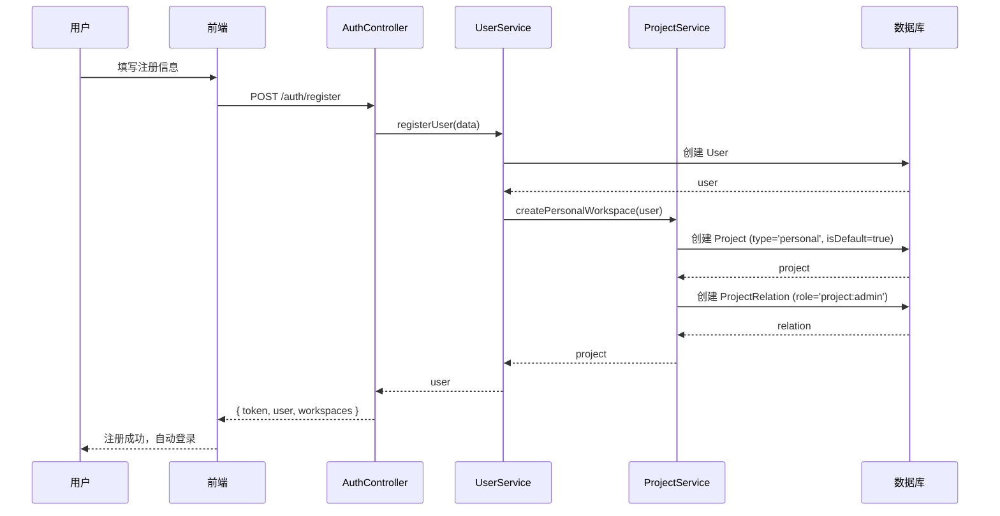

### 3.2 创建团队空间流程

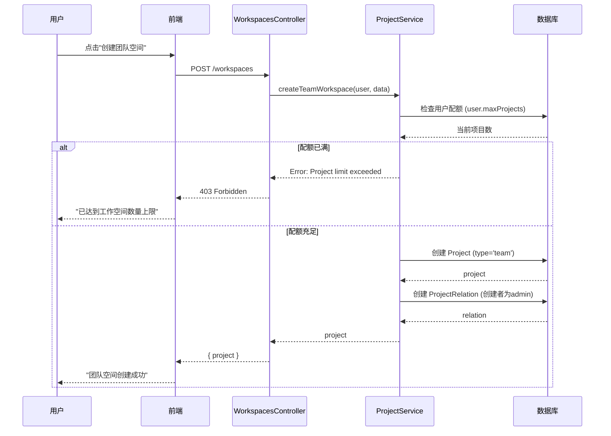

### 3.3 邀请成员流程

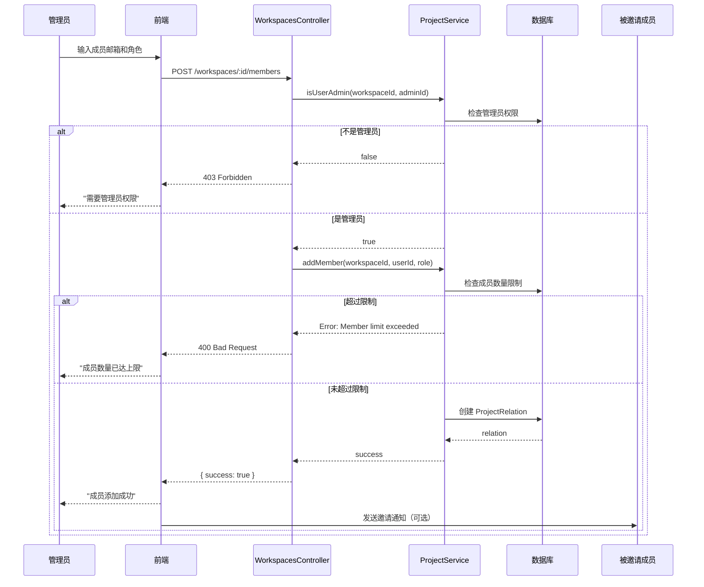

---

## 四、工作空间切换流程

### 4.1 前端切换流程

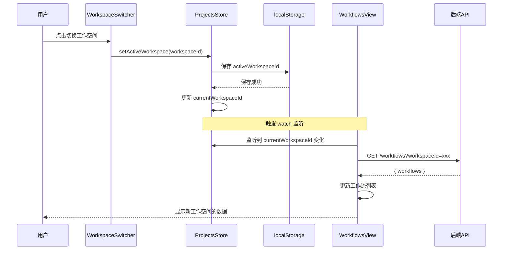

### 4.2 数据隔离验证流程

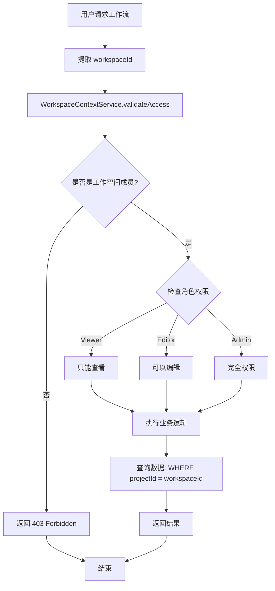

---

## 五、权限管理架构

### 5.1 三级权限模型

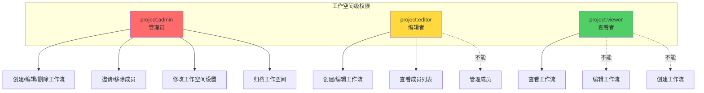

### 5.2 权限检查流程

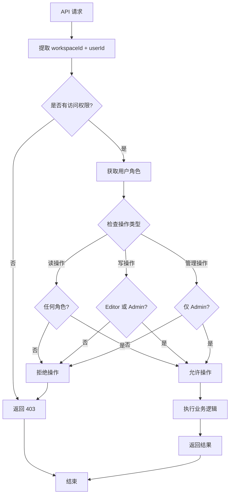

---

## 六、数据查询优化

### 6.1 查询性能对比

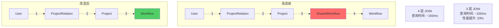

### 6.2 索引策略

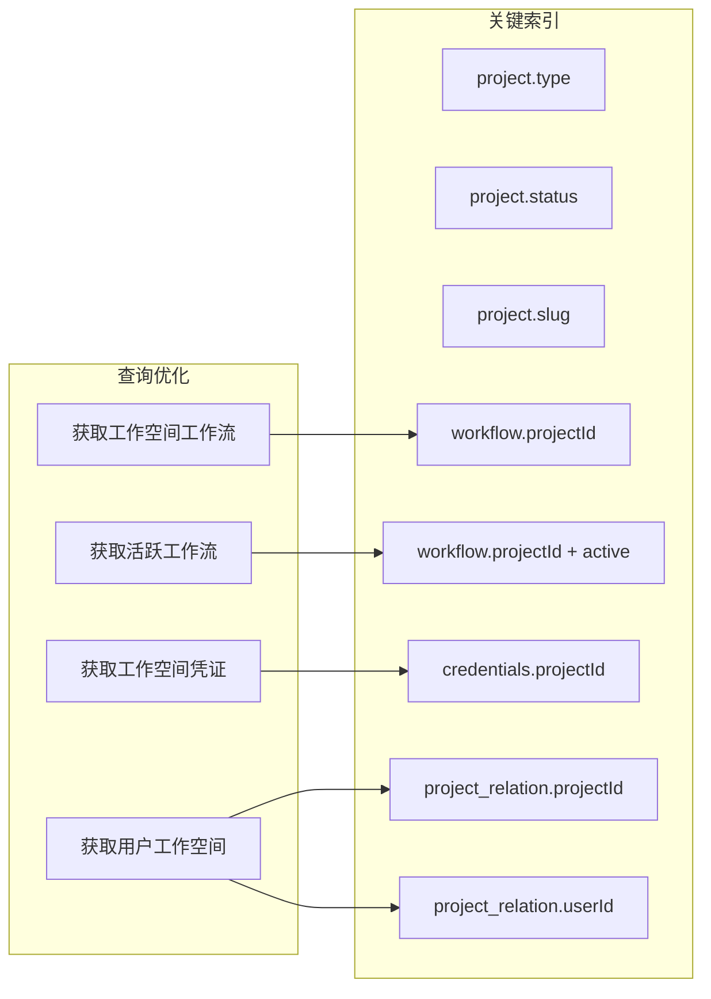

---

## 七、用户体验流程

### 7.1 完整用户旅程

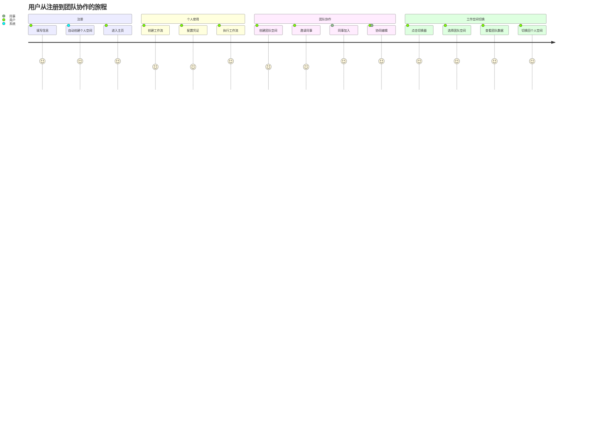

### 7.2 工作空间切换交互流程

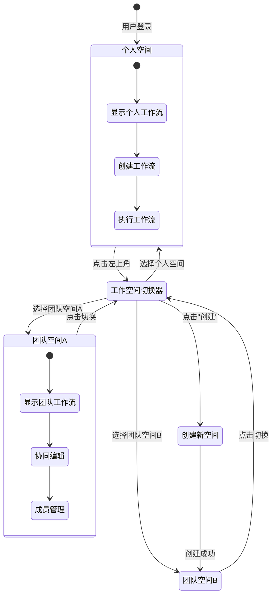

---

## 八、计费系统架构预留（Phase 2）

### 8.1 计费数据流

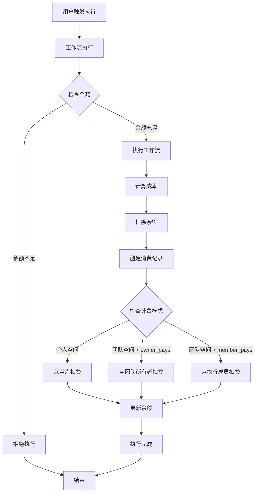

### 8.2 计费相关表结构（预留）

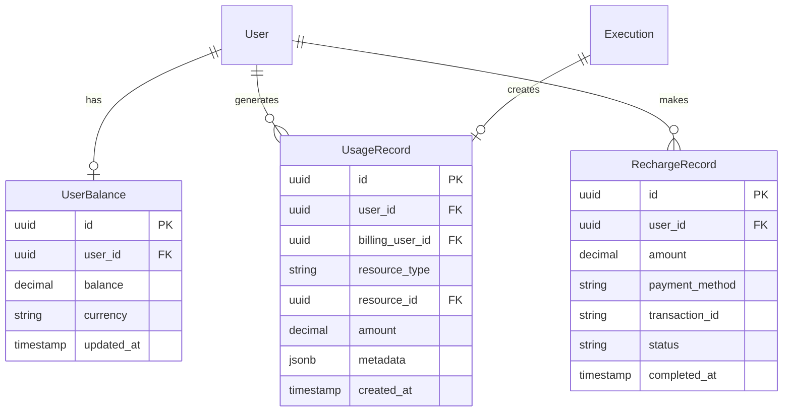

---

## 九、部署架构

### 9.1 系统架构图

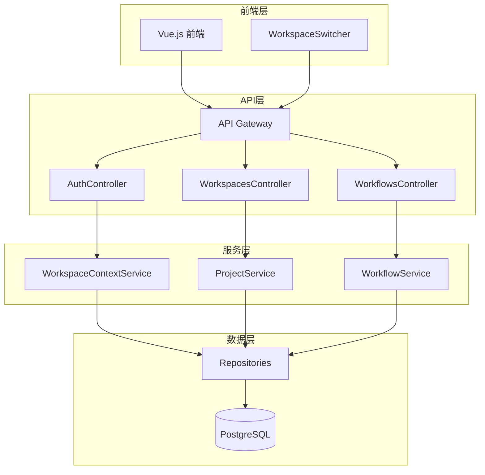

### 9.2 微服务拆分（未来可选）

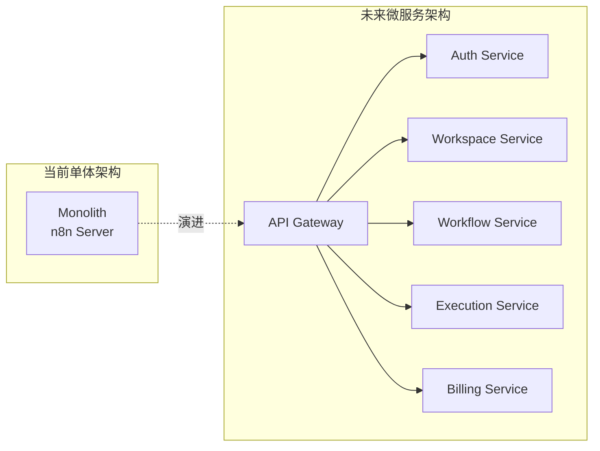

---

## 十、监控和可观测性

### 10.1 关键指标监控

```mermaid
graph TD
    subgraph 性能指标
        M1[工作流列表查询时间]
        M2[工作空间切换时间]
        M3[成员列表查询时间]
        M4[权限检查耗时]
    end

    subgraph 业务指标
        B1[活跃工作空间数]
        B2[团队空间占比]
        B3[平均成员数]
        B4[工作空间切换频率]
    end

    subgraph 告警规则
        A1[查询时间 > 500ms]
        A2[错误率 > 1%]
        A3[权限拒绝率 > 5%]
    end

    M1 --> A1
    M2 --> A1
    M3 --> A1
    M4 --> A2

    A1 -.触发.-> Alert[告警通知]
    A2 -.触发.-> Alert
    A3 -.触发.-> Alert
```

---

## 十一、附录

### 11.1 图例说明

| 符号 | 含义 |
|------|------|
| `-->` | 强关联/必需 |
| `-.->` | 弱关联/可选 |
| `||--o{` | 一对多关系 |
| `||--||` | 一对一关系 |
| `o{--o{` | 多对多关系 |

### 11.2 颜色说明

- 🔴 红色：需要删除或废弃的部分
- 🟢 绿色：新增或优化的部分
- 🟡 黄色：需要注意的部分
- 🔵 蓝色：预留但未实现的部分

---

**文档版本：** v1.0
**最后更新：** 2025-11-03
**配套文档：** 01-架构底层改造方案.md
