# n8n 多租户架构图和流程图（激进改造版）

> **配套文档：** 01-架构底层改造方案.md (v3.0)
> **版本：** v2.0 (激进改造版 + Coze 对标)
> **日期：** 2025-11-07

---

## 一、数据库 E-R 关系图

### 1.1 核心实体关系（激进改造后）

```mermaid
erDiagram
    User ||--o{ ProjectRelation : "belongs to"
    Project ||--o{ ProjectRelation : "has"
    Project ||--o{ Workflow : "owns (direct FK)"
    Project ||--o{ Credentials : "owns (direct FK)"
    Project ||--|| WorkspaceBalance : "has balance"
    Workflow ||--o{ Execution : "generates"
    Execution ||--o| UsageRecord : "creates billing record"
    WorkspaceBalance ||--o{ UsageRecord : "pays for"
    WorkspaceBalance ||--o{ RechargeRecord : "receives"
    PlatformService ||--o{ UsageRecord : "consumed via"
    PlatformRagService ||--o{ UsageRecord : "consumed via"

    User {
        uuid id PK
        string email
        string firstName
        string tier
        int max_projects
        jsonb settings
        boolean is_admin "后台管理员标识"
    }

    Project {
        uuid id PK
        string name
        string type "personal | team"
        string slug
        text description
        boolean is_default
        string status "active | archived | suspended"
        jsonb settings
    }

    ProjectRelation {
        uuid id PK
        uuid project_id FK
        uuid user_id FK
        string role "project:admin | project:editor | project:viewer"
        timestamp joined_at
        uuid invited_by FK
    }

    Workflow {
        uuid id PK
        string name
        uuid project_id FK "直接外键,无需 SharedWorkflow"
        boolean active
        jsonb nodes
        jsonb connections
    }

    Credentials {
        uuid id PK
        string name
        uuid project_id FK "直接外键,无需 SharedCredentials"
        string type
        text data
        boolean is_managed "平台托管凭证"
    }

    Execution {
        uuid id PK
        string workflow_id FK
        uuid workspace_id FK "计费工作空间"
        string status
        timestamp finished_at
    }

    WorkspaceBalance {
        uuid id PK
        uuid workspace_id FK "关联 Project"
        decimal balance_cny "人民币余额"
        decimal low_balance_threshold_cny
        string currency "CNY"
        timestamp updated_at
    }

    PlatformService {
        string service_key PK "如 gpt-4-turbo"
        string service_type "ai_model | tts | stt | image_gen"
        string name
        jsonb pricing_config "计费配置"
        boolean is_active
    }

    PlatformRagService {
        string service_key PK "如 legal-rag-cn"
        string name
        string domain "legal | medical | finance"
        decimal price_per_query_cny
        jsonb metadata
        boolean is_active
    }

    UsageRecord {
        uuid id PK
        uuid workspace_id FK
        uuid user_id FK
        string service_key FK "PlatformService 或 PlatformRagService"
        string service_type
        int tokens_used
        int calls_count
        decimal amount_cny "消费金额(RMB)"
        jsonb metadata
        timestamp created_at
    }

    RechargeRecord {
        uuid id PK
        uuid workspace_id FK
        uuid user_id FK "充值发起人"
        decimal amount_cny
        string payment_method
        string transaction_id
        string status "pending | completed | failed"
        timestamp completed_at
    }
```

### 1.2 改造前后对比

**核心变化：**

| 项目 | 改造前 (v1.0) | 改造后 (v2.0 激进版) |
|------|---------------|---------------------|
| **Workflow 关联** | `Workflow → SharedWorkflow → Project` | `Workflow.projectId → Project` |
| **Credentials 关联** | `Credentials → SharedCredentials → Project` | `Credentials.projectId → Project` |
| **查询层级** | 4 层 JOIN | 3 层 JOIN |
| **性能提升** | - | 30-40% |
| **代码简化** | - | 删除 147 处 SharedWorkflow 引用<br/>删除 95 处 SharedCredentials 引用 |
| **计费系统** | 预留 (UserBalance) | 实际实现 (WorkspaceBalance + RMB) |
| **平台服务** | 无 | PlatformService + PlatformRagService |

---

## 二、架构对比图

### 2.1 改造前后查询路径对比

**改造前（4层JOIN - 已废弃）：**

```mermaid
graph LR
    User[用户] --> PR[ProjectRelation]
    PR --> Project[项目]
    Project --> SW[SharedWorkflow ❌]
    SW --> Workflow[工作流]

    style SW fill:#ff6b6b
    style SW stroke:#ff0000,stroke-width:3px
```

**改造后（3层JOIN - 激进改造）：**

```mermaid
graph LR
    User[用户] --> PR[ProjectRelation]
    PR --> Project[工作空间]
    Project --> Workflow[工作流 ✅]
    Project --> Credentials[凭证 ✅]

    style Project fill:#51cf66
    style Project stroke:#00ff00,stroke-width:3px
    style Workflow fill:#51cf66
    style Credentials fill:#51cf66
```

**关键改进：**
- ❌ 删除 `SharedWorkflow` 表及所有引用（147 处）
- ❌ 删除 `SharedCredentials` 表及所有引用（95 处）
- ✅ 直接在 `Workflow.projectId` 外键关联
- ✅ 直接在 `Credentials.projectId` 外键关联
- ⚡ 性能提升 30-40%

### 2.2 Coze 商业版架构对标

```mermaid
graph TB
    subgraph Coze商业版架构
        CUser[User<br/>用户] --> CWS1[Personal Workspace<br/>个人空间]
        CUser --> CWS2[Team Workspace<br/>团队空间]
        CWS1 --> CB1[Bot/Workflow<br/>工作流]
        CWS2 --> CB2[Bot/Workflow<br/>团队工作流]
        CWS2 --> CMembers[Members<br/>团队成员]

        CUser --> CBilling[Billing Center<br/>计费中心]
        CBilling --> CRGPT[GPT-4 调用<br/>按量计费]
        CBilling --> CRKnowledge[知识库存储<br/>按GB计费]
    end

    subgraph n8n改造后架构
        NUser[User<br/>用户] --> NP1[Project type=personal<br/>个人空间]
        NUser --> NP2[Project type=team<br/>团队空间]
        NP1 --> NW1[Workflow<br/>工作流]
        NP2 --> NW2[Workflow<br/>团队工作流]
        NP2 --> NPR[ProjectRelation<br/>成员关系]

        NP1 --> NBalance1[WorkspaceBalance<br/>个人余额¥]
        NP2 --> NBalance2[WorkspaceBalance<br/>团队余额¥]
        NBalance1 --> NRGPT[PlatformService<br/>AI模型调用]
        NBalance2 --> NRRag[PlatformRagService<br/>垂直RAG服务]
    end

    CUser -.对应.-> NUser
    CWS1 -.对应.-> NP1
    CWS2 -.对应.-> NP2
    CB1 -.对应.-> NW1
    CB2 -.对应.-> NW2
    CMembers -.对应.-> NPR
    CBilling -.对应.-> NBalance1
    CRGPT -.对应.-> NRGPT
    CRKnowledge -.对应.-> NRRag

    style CUser fill:#e3f2fd
    style NUser fill:#e8f5e9
    style CBilling fill:#fff3e0
    style NBalance1 fill:#fff8e1
    style NBalance2 fill:#fff8e1
```

**Coze 对标说明：**

| Coze 概念 | n8n 实现 | 说明 |
|-----------|----------|------|
| Personal Workspace | `Project (type='personal')` | 个人空间，默认创建 |
| Team Workspace | `Project (type='team')` | 团队空间，支持多成员 |
| Bot | `Workflow` | 工作流即为 Bot |
| Billing Center | `WorkspaceBalance` | 工作空间余额(RMB) |
| GPT-4 调用 | `PlatformService` | AI 模型按 token 计费 |
| 知识库存储 | `PlatformRagService` | 垂直领域 RAG 按查询计费 |

---

## 三、平台 RAG 服务架构

### 3.1 平台 RAG 服务概念

**❌ 不做：**
- 不提供通用知识库存储（用户自己用 n8n 连接向量数据库）
- 不做按 GB 存储计费

**✅ 要做：**
- 提供垂直领域专业知识库（法律、医疗、金融等）
- 作为平台插件/节点供用户调用
- 按查询次数计费（RMB）

### 3.2 平台 RAG 服务架构图

```mermaid
graph TB
    subgraph 用户工作流
        UserWorkflow[User Workflow<br/>用户工作流]
        RagNode[Platform RAG Node<br/>平台 RAG 节点]
    end

    subgraph 平台 RAG 服务层
        RagGateway[RAG Service Gateway<br/>RAG 服务网关]
        LegalRag[Legal RAG Service<br/>法律知识库]
        MedicalRag[Medical RAG Service<br/>医疗知识库]
        FinanceRag[Finance RAG Service<br/>金融知识库]
    end

    subgraph 平台向量数据库
        LegalVectorDB[(Legal Vector DB<br/>法律向量库)]
        MedicalVectorDB[(Medical Vector DB<br/>医疗向量库)]
        FinanceVectorDB[(Finance Vector DB<br/>金融向量库)]
    end

    subgraph 计费系统
        BillingService[BillingService<br/>计费服务]
        WorkspaceBalance[WorkspaceBalance<br/>工作空间余额]
    end

    UserWorkflow --> RagNode
    RagNode --> RagGateway

    RagGateway --> LegalRag
    RagGateway --> MedicalRag
    RagGateway --> FinanceRag

    LegalRag --> LegalVectorDB
    MedicalRag --> MedicalVectorDB
    FinanceRag --> FinanceVectorDB

    RagGateway --> BillingService
    BillingService --> WorkspaceBalance

    style RagNode fill:#ffd93d
    style BillingService fill:#ff6b6b
    style WorkspaceBalance fill:#ff6b6b
```

### 3.3 平台 RAG 服务调用流程

```mermaid
sequenceDiagram
    participant User as 用户工作流
    participant Node as PlatformRagNode
    participant Gateway as RAG Gateway
    participant Billing as BillingService
    participant Balance as WorkspaceBalance
    participant RagService as Legal RAG Service
    participant VectorDB as Legal Vector DB

    User->>Node: 触发 RAG 查询<br/>query: "劳动合同纠纷案例"
    Node->>Gateway: POST /api/platform-rag/query
    Gateway->>Billing: checkBalance(workspaceId)
    Billing->>Balance: 查询余额
    Balance-->>Billing: balance_cny: 100.00

    alt 余额不足
        Billing-->>Gateway: Error: Insufficient balance
        Gateway-->>Node: 402 Payment Required
        Node-->>User: "余额不足，请充值"
    else 余额充足
        Billing-->>Gateway: OK
        Gateway->>RagService: query("劳动合同纠纷案例")
        RagService->>VectorDB: 向量搜索
        VectorDB-->>RagService: 返回相关案例
        RagService-->>Gateway: 返回结果

        Gateway->>Billing: recordUsageAndCharge({<br/>  workspaceId,<br/>  serviceKey: "legal-rag-cn",<br/>  serviceType: "rag_service",<br/>  callsCount: 1,<br/>  amountCny: 0.50<br/>})
        Billing->>Balance: 扣除 ¥0.50
        Billing->>UsageRecord: 创建使用记录

        Gateway-->>Node: 返回 RAG 结果
        Node-->>User: 显示法律案例结果
    end
```

**计费示例：**
- `legal-rag-cn`: ¥0.50/次查询
- `medical-rag-cn`: ¥0.80/次查询
- `finance-rag-cn`: ¥0.60/次查询

---

## 四、工作空间管理流程

### 4.1 用户注册流程（含个人余额初始化）

```mermaid
sequenceDiagram
    participant U as 用户
    participant F as 前端
    participant A as AuthController
    participant US as UserService
    participant PS as ProjectService
    participant BS as BillingService
    participant DB as 数据库

    U->>F: 填写注册信息
    F->>A: POST /auth/register
    A->>US: registerUser(data)
    US->>DB: 创建 User
    DB-->>US: user

    US->>PS: createPersonalWorkspace(user)
    PS->>DB: 创建 Project (type='personal', isDefault=true)
    DB-->>PS: project
    PS->>DB: 创建 ProjectRelation (role='project:admin')
    DB-->>PS: relation

    PS->>BS: initializeWorkspaceBalance(project.id)
    BS->>DB: 创建 WorkspaceBalance (balance_cny=0, threshold=10)
    DB-->>BS: balance

    PS-->>US: project
    US-->>A: user
    A-->>F: { token, user, workspaces }
    F-->>U: 注册成功，自动登录<br/>💰 初始余额: ¥0.00
```

### 4.2 创建团队空间流程

```mermaid
sequenceDiagram
    participant U as 用户
    participant F as 前端
    participant W as WorkspacesController
    participant PS as ProjectService
    participant BS as BillingService
    participant DB as 数据库

    U->>F: 点击"创建团队空间"
    F->>W: POST /workspaces
    W->>PS: createTeamWorkspace(user, data)

    PS->>DB: 检查用户配额 (user.maxProjects)
    DB-->>PS: 当前项目数

    alt 配额已满
        PS-->>W: Error: Project limit exceeded
        W-->>F: 403 Forbidden
        F-->>U: "已达到工作空间数量上限"
    else 配额充足
        PS->>DB: 创建 Project (type='team')
        DB-->>PS: project
        PS->>DB: 创建 ProjectRelation (创建者为admin)
        DB-->>PS: relation

        PS->>BS: initializeWorkspaceBalance(project.id)
        BS->>DB: 创建 WorkspaceBalance (balance_cny=0)
        DB-->>BS: balance

        PS-->>W: project
        W-->>F: { project }
        F-->>U: "团队空间创建成功"<br/>💰 团队余额: ¥0.00
    end
```

### 4.3 工作空间充值流程

```mermaid
sequenceDiagram
    participant U as 用户
    participant F as 前端
    participant BC as BillingController
    participant BS as BillingService
    participant Payment as 支付网关
    participant DB as 数据库

    U->>F: 点击"充值"，输入金额 ¥100
    F->>BC: POST /billing/recharge
    BC->>BS: createRechargeOrder({<br/>  workspaceId,<br/>  userId,<br/>  amountCny: 100<br/>})
    BS->>DB: 创建 RechargeRecord (status='pending')
    DB-->>BS: record
    BS-->>BC: { orderId, paymentUrl }
    BC-->>F: { paymentUrl }

    F->>U: 跳转到支付页面
    U->>Payment: 完成支付
    Payment->>BC: POST /billing/recharge/callback
    BC->>BS: handleRechargeCallback(orderId)
    BS->>DB: 更新 RechargeRecord (status='completed')
    BS->>DB: 更新 WorkspaceBalance (+100.00)
    DB-->>BS: success
    BS-->>BC: success
    BC-->>Payment: 200 OK

    Payment->>F: 重定向回前端
    F->>F: 刷新余额
    F-->>U: "充值成功！当前余额: ¥100.00"
```

---

## 五、权限管理架构

### 5.1 三级权限模型（不变）

```mermaid
graph TB
    subgraph 工作空间级权限
        Admin[project:admin<br/>管理员]
        Editor[project:editor<br/>编辑者]
        Viewer[project:viewer<br/>查看者]
    end

    Admin --> A1[创建/编辑/删除工作流]
    Admin --> A2[邀请/移除成员]
    Admin --> A3[修改工作空间设置]
    Admin --> A4[工作空间充值]
    Admin --> A5[查看消费明细]

    Editor --> E1[创建/编辑工作流]
    Editor --> E2[查看成员列表]
    Editor --> E3[查看余额]
    Editor -.不能.-> E4[充值]
    Editor -.不能.-> E5[管理成员]

    Viewer --> V1[查看工作流]
    Viewer --> V2[查看余额]
    Viewer -.不能.-> V3[编辑工作流]
    Viewer -.不能.-> V4[创建工作流]

    style Admin fill:#ff6b6b
    style Editor fill:#ffd93d
    style Viewer fill:#51cf66
```

### 5.2 后台管理员权限架构（新增）

```mermaid
graph TB
    subgraph 超级管理员权限
        SuperAdmin[is_admin=true<br/>超级管理员]
    end

    SuperAdmin --> SA1[管理平台服务]
    SuperAdmin --> SA2[管理平台 RAG 服务]
    SuperAdmin --> SA3[查看所有工作空间]
    SuperAdmin --> SA4[工作空间充值/扣费]
    SuperAdmin --> SA5[查看平台统计数据]
    SuperAdmin --> SA6[系统配置管理]

    SA1 --> SA1A[创建/编辑/禁用 AI 模型]
    SA1 --> SA1B[配置 AI 模型价格]

    SA2 --> SA2A[创建/编辑 RAG 服务]
    SA2 --> SA2B[配置 RAG 服务价格]

    SA3 --> SA3A[搜索工作空间]
    SA3 --> SA3B[查看工作空间详情]
    SA3 --> SA3C[暂停/恢复工作空间]

    SA4 --> SA4A[管理员充值]
    SA4 --> SA4B[管理员扣费]
    SA4 --> SA4C[查看充值记录]

    SA5 --> SA5A[平台收入统计]
    SA5 --> SA5B[服务使用排行]
    SA5 --> SA5C[活跃工作空间统计]

    style SuperAdmin fill:#9c27b0
    style SA1 fill:#e1bee7
    style SA2 fill:#e1bee7
    style SA3 fill:#e1bee7
    style SA4 fill:#e1bee7
    style SA5 fill:#e1bee7
```

---

## 六、后台管理系统架构

### 6.1 后台管理系统 E-R 图

```mermaid
erDiagram
    User ||--o{ AdminLog : "operates"
    PlatformService ||--o{ UsageRecord : "consumed"
    PlatformRagService ||--o{ UsageRecord : "consumed"

    User {
        uuid id PK
        string email
        boolean is_admin "管理员标识"
    }

    AdminLog {
        uuid id PK
        uuid admin_id FK
        string action "create_service | edit_service | recharge | suspend_workspace"
        string target_type "platform_service | workspace | rag_service"
        uuid target_id
        jsonb metadata
        timestamp created_at
    }

    PlatformService {
        string service_key PK
        string service_type "ai_model | tts | stt | image_gen"
        string name
        jsonb pricing_config
        boolean is_active
        timestamp created_at
        timestamp updated_at
    }

    PlatformRagService {
        string service_key PK
        string name
        string domain
        decimal price_per_query_cny
        jsonb metadata
        boolean is_active
        timestamp created_at
        timestamp updated_at
    }
```

### 6.2 后台管理系统架构图

```mermaid
graph TB
    subgraph 后台前端层
        AdminUI[Admin UI<br/>后台管理前端]
        Dashboard[Dashboard<br/>统计面板]
        ServiceMgmt[Service Management<br/>服务管理]
        WorkspaceMgmt[Workspace Management<br/>工作空间管理]
    end

    subgraph 后台 API 层
        AdminAuth[AdminAuthMiddleware<br/>管理员鉴权]
        AdminPlatformSvc[AdminPlatformServicesController]
        AdminWorkspace[AdminWorkspacesController]
        AdminStats[AdminStatsController]
    end

    subgraph 服务层
        PlatformSvcService[PlatformServiceService]
        BillingService[BillingService]
        StatsService[StatsService]
    end

    subgraph 数据层
        DB[(PostgreSQL)]
    end

    AdminUI --> AdminAuth
    Dashboard --> AdminAuth
    ServiceMgmt --> AdminAuth
    WorkspaceMgmt --> AdminAuth

    AdminAuth --> AdminPlatformSvc
    AdminAuth --> AdminWorkspace
    AdminAuth --> AdminStats

    AdminPlatformSvc --> PlatformSvcService
    AdminWorkspace --> BillingService
    AdminStats --> StatsService

    PlatformSvcService --> DB
    BillingService --> DB
    StatsService --> DB

    style AdminAuth fill:#9c27b0
    style AdminPlatformSvc fill:#e1bee7
    style AdminWorkspace fill:#e1bee7
    style AdminStats fill:#e1bee7
```

### 6.3 平台服务管理流程

```mermaid
sequenceDiagram
    participant Admin as 管理员
    participant UI as 后台 UI
    participant API as AdminPlatformServicesController
    participant Service as PlatformServiceService
    participant DB as 数据库

    Admin->>UI: 登录后台管理系统
    UI->>API: GET /admin/platform-services
    API->>Service: listAllServices()
    Service->>DB: 查询 platform_services 和 platform_rag_services
    DB-->>Service: 服务列表
    Service-->>API: 返回服务
    API-->>UI: { services: [...] }
    UI-->>Admin: 显示服务列表

    Admin->>UI: 点击"新增 AI 模型"
    UI->>Admin: 显示表单
    Admin->>UI: 填写信息（service_key, name, pricing_config）
    UI->>API: POST /admin/platform-services
    API->>Service: createService(data)
    Service->>DB: INSERT INTO platform_services
    DB-->>Service: service
    Service->>DB: INSERT INTO admin_logs (action='create_service')
    Service-->>API: success
    API-->>UI: { service }
    UI-->>Admin: "AI 模型创建成功"

    Admin->>UI: 点击"编辑"按钮
    UI->>Admin: 显示编辑表单
    Admin->>UI: 修改价格配置
    UI->>API: PATCH /admin/platform-services/:key
    API->>Service: updateService(serviceKey, updates)
    Service->>DB: UPDATE platform_services
    Service->>DB: INSERT INTO admin_logs (action='edit_service')
    Service-->>API: success
    API-->>UI: { service }
    UI-->>Admin: "价格更新成功"
```

### 6.4 工作空间管理流程（管理员充值）

```mermaid
sequenceDiagram
    participant Admin as 管理员
    participant UI as 后台 UI
    participant API as AdminWorkspacesController
    participant BS as BillingService
    participant DB as 数据库

    Admin->>UI: 搜索工作空间
    UI->>API: GET /admin/workspaces?search=用户邮箱
    API->>DB: 查询工作空间
    DB-->>API: 工作空间列表
    API-->>UI: { workspaces: [...] }
    UI-->>Admin: 显示工作空间列表

    Admin->>UI: 点击"充值"
    UI->>Admin: 显示充值表单
    Admin->>UI: 输入金额 ¥500 和备注
    UI->>API: POST /admin/workspaces/:id/recharge
    API->>BS: adminRecharge({<br/>  workspaceId,<br/>  adminId,<br/>  amountCny: 500,<br/>  note: "管理员补偿充值"<br/>})
    BS->>DB: 创建 RechargeRecord (status='completed', payment_method='admin')
    BS->>DB: 更新 WorkspaceBalance (+500.00)
    BS->>DB: 创建 AdminLog (action='admin_recharge')
    DB-->>BS: success
    BS-->>API: success
    API-->>UI: { success: true }
    UI-->>Admin: "充值成功！工作空间余额已更新"
```

### 6.5 平台统计数据流程

```mermaid
sequenceDiagram
    participant Admin as 管理员
    participant UI as Dashboard
    participant API as AdminStatsController
    participant Stats as StatsService
    participant DB as 数据库

    Admin->>UI: 打开统计面板
    UI->>API: GET /admin/stats/overview
    API->>Stats: getOverview(dateRange)

    Stats->>DB: 查询 usage_records (聚合)
    DB-->>Stats: 总收入、总调用次数

    Stats->>DB: 查询 workspace_balance (聚合)
    DB-->>Stats: 平台总余额

    Stats->>DB: 查询 project (聚合)
    DB-->>Stats: 活跃工作空间数

    Stats->>DB: 查询 recharge_records (聚合)
    DB-->>Stats: 充值统计

    Stats-->>API: { overview: {...} }
    API-->>UI: { overview: {...} }
    UI-->>Admin: 显示统计图表

    Admin->>UI: 查看热门服务排行
    UI->>API: GET /admin/stats/popular-services
    API->>Stats: getPopularServices()
    Stats->>DB: 查询 usage_records (GROUP BY service_key, ORDER BY calls_count DESC)
    DB-->>Stats: 服务排行数据
    Stats-->>API: { services: [...] }
    API-->>UI: { services: [...] }
    UI-->>Admin: 显示服务排行榜
```

---

## 七、计费系统架构（实际实现）

### 7.1 计费数据流（RMB 直接计费）

```mermaid
flowchart TD
    User[用户触发执行] --> Workflow[工作流执行]
    Workflow --> CheckNode{是否调用平台服务?}

    CheckNode -->|否| NormalExec[普通执行,不计费]
    CheckNode -->|是| IdentifyService[识别服务类型]

    IdentifyService --> TypeCheck{服务类型?}
    TypeCheck -->|AI 模型| AIModel[PlatformService<br/>AI 模型调用]
    TypeCheck -->|RAG 服务| RagService[PlatformRagService<br/>RAG 查询]
    TypeCheck -->|TTS/STT/图像| OtherService[其他平台服务]

    AIModel --> CheckBalance{检查余额}
    RagService --> CheckBalance
    OtherService --> CheckBalance

    CheckBalance -->|余额不足| Stop[拒绝执行<br/>返回 402]
    CheckBalance -->|余额充足| Execute[执行服务调用]

    Execute --> CalcCost[计算成本<br/>基于 pricing_config]
    CalcCost --> Deduct[扣除余额<br/>WorkspaceBalance]

    Deduct --> CreateRecord[创建 UsageRecord<br/>记录消费详情]
    CreateRecord --> CheckThreshold{余额低于阈值?}

    CheckThreshold -->|是| SendAlert[发送低余额告警]
    CheckThreshold -->|否| ExecutionComplete[执行完成]

    Stop --> End[结束]
    NormalExec --> End
    SendAlert --> ExecutionComplete
    ExecutionComplete --> End
```

### 7.2 AI 模型调用计费示例

```mermaid
sequenceDiagram
    participant Workflow as 用户工作流
    participant Node as AI Model Node
    participant Billing as BillingService
    participant Balance as WorkspaceBalance
    participant LLM as OpenAI API
    participant Usage as UsageRecord

    Workflow->>Node: 触发 GPT-4 调用
    Node->>Billing: checkBalance(workspaceId)
    Billing->>Balance: 查询余额
    Balance-->>Billing: balance_cny: 50.00

    alt 余额不足 (< ¥0.10)
        Billing-->>Node: Error: Insufficient balance
        Node-->>Workflow: "余额不足，请充值"
    else 余额充足
        Billing-->>Node: OK
        Node->>LLM: POST /chat/completions
        LLM-->>Node: { tokens: 1500 }

        Node->>Billing: recordUsageAndCharge({<br/>  workspaceId,<br/>  serviceKey: "gpt-4-turbo",<br/>  tokensUsed: 1500<br/>})

        Billing->>Billing: 计算成本<br/>¥0.015/1k tokens × 1.5 = ¥0.0225
        Billing->>Balance: 扣除 ¥0.0225
        Balance-->>Billing: 新余额: ¥49.9775

        Billing->>Usage: 创建使用记录
        Usage-->>Billing: record created

        Billing-->>Node: success
        Node-->>Workflow: 返回 AI 结果
    end
```

### 7.3 计费相关表结构（实际实现）

```mermaid
erDiagram
    WorkspaceBalance ||--o{ UsageRecord : "pays for"
    WorkspaceBalance ||--o{ RechargeRecord : "receives"
    PlatformService ||--o{ UsageRecord : "consumed via"
    PlatformRagService ||--o{ UsageRecord : "consumed via"

    WorkspaceBalance {
        uuid id PK
        uuid workspace_id FK
        decimal balance_cny "人民币余额"
        decimal low_balance_threshold_cny "低余额告警阈值"
        string currency "CNY"
        timestamp updated_at
    }

    UsageRecord {
        uuid id PK
        uuid workspace_id FK
        uuid user_id FK
        string service_key FK
        string service_type "ai_model | rag_service | tts | stt | image_gen"
        int tokens_used "仅 AI 模型"
        int calls_count "调用次数"
        decimal amount_cny "消费金额(RMB)"
        jsonb metadata "详细信息"
        timestamp created_at
    }

    RechargeRecord {
        uuid id PK
        uuid workspace_id FK
        uuid user_id FK
        decimal amount_cny "充值金额(RMB)"
        string payment_method "alipay | wechat | admin"
        string transaction_id "交易ID"
        string status "pending | completed | failed"
        timestamp completed_at
    }

    PlatformService {
        string service_key PK
        string service_type
        string name
        jsonb pricing_config "{ pricePerToken: 0.00001, currency: 'CNY' }"
        boolean is_active
    }

    PlatformRagService {
        string service_key PK
        string name
        decimal price_per_query_cny "每次查询价格"
        boolean is_active
    }
```

---

## 八、用户体验流程

### 8.1 完整用户旅程（含计费）

```mermaid
journey
    title 用户从注册到平台服务使用的旅程
    section 注册
      填写信息: 5: 用户
      自动创建个人空间: 5: 系统
      初始化余额(¥0): 5: 系统
      进入主页: 5: 用户
    section 个人使用
      创建工作流: 4: 用户
      添加 AI 节点: 4: 用户
      发现余额不足: 2: 用户
      充值 ¥100: 3: 用户
      执行工作流: 5: 用户
    section 平台服务使用
      调用 GPT-4: 5: 用户
      查询法律 RAG: 5: 用户
      查看消费明细: 4: 用户
      余额告警: 2: 用户
      再次充值: 3: 用户
    section 团队协作
      创建团队空间: 4: 用户
      团队充值 ¥500: 4: 用户
      邀请同事: 4: 用户
      同事使用团队余额: 5: 同事
      协同编辑: 5: 用户, 同事
```

### 8.2 工作空间切换交互流程（含余额显示）

```mermaid
stateDiagram-v2
    [*] --> 个人空间: 用户登录

    state 个人空间 {
        [*] --> 显示个人工作流
        显示个人工作流 --> 显示余额_个人: 💰 余额: ¥50.00
        显示余额_个人 --> 创建工作流
        创建工作流 --> 执行工作流
        执行工作流 --> 扣费_个人: 消费 ¥0.50
        扣费_个人 --> 显示余额_个人
    }

    个人空间 --> 工作空间切换器: 点击左上角
    工作空间切换器 --> 个人空间: 选择个人空间
    工作空间切换器 --> 团队空间A: 选择团队空间A
    工作空间切换器 --> 创建新空间: 点击"创建"

    state 团队空间A {
        [*] --> 显示团队工作流
        显示团队工作流 --> 显示余额_团队: 💰 团队余额: ¥200.00
        显示余额_团队 --> 协同编辑
        协同编辑 --> 成员管理
        成员管理 --> 充值: 管理员充值
        充值 --> 显示余额_团队
    }

    团队空间A --> 工作空间切换器: 点击切换
    创建新空间 --> 团队空间A: 创建成功
```

---

## 九、部署架构

### 9.1 系统架构图（含后台管理）

```mermaid
graph TB
    subgraph 用户前端层
        UserUI[Vue.js 用户前端]
        WS[WorkspaceSwitcher<br/>工作空间切换器]
    end

    subgraph 管理员前端层
        AdminUI[Vue.js 后台管理前端]
    end

    subgraph API Gateway
        Gateway[Nginx / API Gateway]
    end

    subgraph 用户 API 层
        Auth[AuthController]
        Workspaces[WorkspacesController]
        Workflows[WorkflowsController]
        Billing[BillingController]
    end

    subgraph 管理员 API 层
        AdminAuth[AdminAuthMiddleware]
        AdminPlatform[AdminPlatformServicesController]
        AdminWorkspace[AdminWorkspacesController]
        AdminStats[AdminStatsController]
    end

    subgraph 服务层
        WCS[WorkspaceContextService]
        PS[ProjectService]
        WFS[WorkflowService]
        BS[BillingService]
        PlatformSvc[PlatformServiceService]
        StatsService[StatsService]
    end

    subgraph 平台服务层
        RagGateway[RAG Service Gateway]
        LLMProxy[LLM API Proxy]
    end

    subgraph 数据层
        Repo[Repositories]
        DB[(PostgreSQL)]
        Redis[(Redis Cache)]
    end

    UserUI --> Gateway
    WS --> Gateway
    AdminUI --> Gateway

    Gateway --> Auth
    Gateway --> Workspaces
    Gateway --> Workflows
    Gateway --> Billing
    Gateway --> AdminAuth

    AdminAuth --> AdminPlatform
    AdminAuth --> AdminWorkspace
    AdminAuth --> AdminStats

    Auth --> WCS
    Workspaces --> PS
    Workflows --> WFS
    Billing --> BS

    AdminPlatform --> PlatformSvc
    AdminWorkspace --> BS
    AdminStats --> StatsService

    WFS --> RagGateway
    WFS --> LLMProxy
    BS --> PlatformSvc

    WCS --> Repo
    PS --> Repo
    WFS --> Repo
    BS --> Repo
    PlatformSvc --> Repo
    StatsService --> Repo

    Repo --> DB
    Repo --> Redis

    style AdminUI fill:#9c27b0
    style AdminAuth fill:#e1bee7
    style AdminPlatform fill:#e1bee7
    style AdminWorkspace fill:#e1bee7
    style AdminStats fill:#e1bee7
```

### 9.2 数据库索引策略（优化）

```mermaid
graph TB
    subgraph 核心索引
        I1[project.type<br/>工作空间类型查询]
        I2[project.status<br/>状态过滤]
        I3[project.slug<br/>唯一标识查询]
        I4[workflow.projectId<br/>工作流查询核心]
        I5[workflow.projectId + active<br/>活跃工作流查询]
        I6[credentials.projectId<br/>凭证查询核心]
        I7[project_relation.projectId<br/>成员查询]
        I8[project_relation.userId<br/>用户工作空间查询]
    end

    subgraph 计费相关索引
        B1[workspace_balance.workspace_id<br/>余额查询]
        B2[usage_record.workspace_id<br/>消费明细查询]
        B3[usage_record.workspace_id + created_at<br/>按时间范围查询]
        B4[usage_record.service_key<br/>服务使用统计]
        B5[recharge_record.workspace_id<br/>充值记录查询]
        B6[recharge_record.workspace_id + status<br/>充值状态查询]
    end

    subgraph 平台服务索引
        S1[platform_service.service_key<br/>服务查询主键]
        S2[platform_service.is_active<br/>活跃服务过滤]
        S3[platform_rag_service.service_key<br/>RAG 服务主键]
        S4[platform_rag_service.domain<br/>领域分类查询]
    end

    style I4 fill:#51cf66,stroke:#00ff00,stroke-width:3px
    style I5 fill:#51cf66,stroke:#00ff00,stroke-width:3px
    style I6 fill:#51cf66,stroke:#00ff00,stroke-width:3px
    style B1 fill:#ffd93d
    style B2 fill:#ffd93d
    style B3 fill:#ffd93d
```

**关键查询优化：**

| 查询场景 | 改造前 | 改造后 | 性能提升 |
|---------|--------|--------|---------|
| 获取工作空间工作流 | 4 层 JOIN | 3 层 JOIN | **~35%** |
| 获取活跃工作流 | 4 层 JOIN + WHERE | 3 层 JOIN + 复合索引 | **~40%** |
| 获取工作空间凭证 | 4 层 JOIN | 3 层 JOIN | **~35%** |
| 查询余额 | N/A | 单表查询 + 索引 | **新增** |
| 消费记录统计 | N/A | 复合索引 + 聚合 | **新增** |

---

## 十、监控和可观测性

### 10.1 关键指标监控（含计费指标）

```mermaid
graph TD
    subgraph 性能指标
        M1[工作流列表查询时间<br/>目标: < 100ms]
        M2[工作空间切换时间<br/>目标: < 50ms]
        M3[权限检查耗时<br/>目标: < 10ms]
        M4[余额查询时间<br/>目标: < 20ms]
    end

    subgraph 业务指标
        B1[活跃工作空间数<br/>按日/周/月统计]
        B2[平台总余额<br/>实时监控]
        B3[日充值金额<br/>财务指标]
        B4[日消费金额<br/>收入指标]
        B5[热门服务 TOP 10<br/>运营参考]
    end

    subgraph 计费指标
        C1[低余额工作空间数<br/>< ¥10]
        C2[零余额工作空间数<br/>= ¥0]
        C3[单日消费峰值<br/>异常检测]
        C4[服务调用失败率<br/>质量监控]
    end

    subgraph 告警规则
        A1[查询时间 > 500ms<br/>性能告警]
        A2[错误率 > 1%<br/>稳定性告警]
        A3[日充值下降 > 50%<br/>业务告警]
        A4[低余额工作空间 > 100<br/>运营告警]
    end

    M1 --> A1
    M2 --> A1
    B4 --> A3
    C1 --> A4

    A1 -.触发.-> Alert[PagerDuty / 飞书告警]
    A2 -.触发.-> Alert
    A3 -.触发.-> Alert
    A4 -.触发.-> Alert
```

### 10.2 后台管理统计面板

```mermaid
graph TB
    subgraph Dashboard 核心指标
        D1[平台总收入<br/>累计 RMB]
        D2[今日收入<br/>实时统计]
        D3[活跃工作空间<br/>近 7 日活跃]
        D4[服务调用总量<br/>累计次数]
    end

    subgraph 收入趋势图表
        T1[近 30 天收入趋势<br/>折线图]
        T2[服务类型收入占比<br/>饼图]
        T3[充值渠道分布<br/>柱状图]
    end

    subgraph 服务排行榜
        R1[热门 AI 模型 TOP 10<br/>按调用次数]
        R2[热门 RAG 服务 TOP 5<br/>按收入]
        R3[大客户工作空间 TOP 10<br/>按消费金额]
    end

    Dashboard --> D1
    Dashboard --> D2
    Dashboard --> D3
    Dashboard --> D4

    Dashboard --> T1
    Dashboard --> T2
    Dashboard --> T3

    Dashboard --> R1
    Dashboard --> R2
    Dashboard --> R3

    style D1 fill:#51cf66
    style D2 fill:#ffd93d
    style D3 fill:#51cf66
    style D4 fill:#51cf66
```

---

## 十一、附录

### 11.1 激进改造核心变更对比

| 项目 | v1.0 (渐进式) | v2.0 (激进改造) | 说明 |
|------|---------------|-----------------|------|
| **SharedWorkflow** | 保留，逐步迁移 | **直接删除** | 删除所有 147 处引用 |
| **SharedCredentials** | 保留，逐步迁移 | **直接删除** | 删除所有 95 处引用 |
| **数据库迁移** | 双写 → 迁移 → 删除 | **一次性重写** | 直接添加 projectId 字段 |
| **兼容性** | 保持向后兼容 | **不保持兼容** | 适合未上线项目 |
| **计费系统** | 预留设计 | **完整实现** | WorkspaceBalance + RMB |
| **平台服务** | 未规划 | **完整设计** | PlatformService + RagService |
| **后台管理** | 未规划 | **完整实现** | 管理员权限 + 统计面板 |
| **实施周期** | 6-8 周 | **15-16 周** | 包含计费和后台系统 |

### 11.2 图例说明

| 符号 | 含义 |
|------|------|
| `-->` | 强关联/必需 |
| `-.->` | 弱关联/可选 |
| `||--o{` | 一对多关系 |
| `||--||` | 一对一关系 |
| `o{--o{` | 多对多关系 |

### 11.3 颜色说明

- 🔴 红色 (#ff6b6b)：需要删除或废弃的部分 (SharedWorkflow)
- 🟢 绿色 (#51cf66)：新增或优化的部分 (直接 projectId)
- 🟡 黄色 (#ffd93d)：需要注意的部分 (计费相关)
- 🔵 蓝色 (#e3f2fd)：对标参考 (Coze 架构)
- 🟣 紫色 (#9c27b0)：管理员功能 (后台系统)

### 11.4 关键实体字段变更

**Project (工作空间):**
```typescript
// 新增字段
slug: string;                    // URL 友好标识
isDefault: boolean;              // 是否默认个人空间
status: 'active' | 'archived' | 'suspended';
settings: {
  maxMembers?: number;           // 团队空间成员上限
  billingMode?: 'owner_pays' | 'member_pays';
};
```

**Workflow (工作流):**
```typescript
// 新增字段
projectId: string;               // 直接外键 → Project (删除 SharedWorkflow)
```

**Credentials (凭证):**
```typescript
// 新增字段
projectId: string;               // 直接外键 → Project (删除 SharedCredentials)
isManaged: boolean;              // 是否平台托管凭证
```

**User (用户):**
```typescript
// 新增字段
isAdmin: boolean;                // 后台管理员标识
```

### 11.5 迁移 SQL 示例（激进版）

```sql
-- ⚠️ 激进改造：直接删除 SharedWorkflow 和 SharedCredentials

-- 第一步：为 Workflow 添加 projectId
ALTER TABLE workflow ADD COLUMN project_id UUID;

-- 第二步：数据迁移（从 SharedWorkflow 迁移）
UPDATE workflow w
SET project_id = (
  SELECT sw.project_id
  FROM shared_workflow sw
  WHERE sw.workflow_id = w.id
  AND sw.role = 'workflow:owner'
  LIMIT 1
);

-- 第三步：添加外键约束
ALTER TABLE workflow
  ADD CONSTRAINT fk_workflow_project
  FOREIGN KEY (project_id) REFERENCES project(id) ON DELETE CASCADE;

-- 第四步：创建索引
CREATE INDEX idx_workflow_project_id ON workflow(project_id);
CREATE INDEX idx_workflow_project_active ON workflow(project_id, active);

-- 第五步：删除 SharedWorkflow（激进！）
DROP TABLE shared_workflow;

-- 第六步：重复 Credentials 的相同步骤
ALTER TABLE credentials ADD COLUMN project_id UUID;
UPDATE credentials c
SET project_id = (
  SELECT sc.project_id FROM shared_credentials sc
  WHERE sc.credentials_id = c.id
  LIMIT 1
);
ALTER TABLE credentials
  ADD CONSTRAINT fk_credentials_project
  FOREIGN KEY (project_id) REFERENCES project(id) ON DELETE CASCADE;
CREATE INDEX idx_credentials_project_id ON credentials(project_id);
DROP TABLE shared_credentials;

-- 第七步：添加计费相关表
CREATE TABLE workspace_balance (
  id UUID PRIMARY KEY DEFAULT gen_random_uuid(),
  workspace_id UUID NOT NULL UNIQUE REFERENCES project(id) ON DELETE CASCADE,
  balance_cny NUMERIC(10, 4) DEFAULT 0.0000,
  low_balance_threshold_cny NUMERIC(10, 4) DEFAULT 10.0000,
  currency VARCHAR(3) DEFAULT 'CNY',
  updated_at TIMESTAMP DEFAULT NOW()
);

CREATE TABLE platform_service (
  service_key VARCHAR(100) PRIMARY KEY,
  service_type VARCHAR(50) NOT NULL,
  name VARCHAR(200) NOT NULL,
  pricing_config JSONB NOT NULL,
  is_active BOOLEAN DEFAULT true,
  created_at TIMESTAMP DEFAULT NOW(),
  updated_at TIMESTAMP DEFAULT NOW()
);

CREATE TABLE platform_rag_service (
  service_key VARCHAR(100) PRIMARY KEY,
  name VARCHAR(200) NOT NULL,
  domain VARCHAR(50) NOT NULL,
  price_per_query_cny NUMERIC(10, 4) NOT NULL,
  metadata JSONB,
  is_active BOOLEAN DEFAULT true,
  created_at TIMESTAMP DEFAULT NOW(),
  updated_at TIMESTAMP DEFAULT NOW()
);

CREATE TABLE usage_record (
  id UUID PRIMARY KEY DEFAULT gen_random_uuid(),
  workspace_id UUID NOT NULL REFERENCES project(id) ON DELETE CASCADE,
  user_id UUID NOT NULL REFERENCES user(id),
  service_key VARCHAR(100) NOT NULL,
  service_type VARCHAR(50) NOT NULL,
  tokens_used INT,
  calls_count INT DEFAULT 1,
  amount_cny NUMERIC(10, 4) NOT NULL,
  metadata JSONB,
  created_at TIMESTAMP DEFAULT NOW()
);

CREATE INDEX idx_usage_record_workspace ON usage_record(workspace_id);
CREATE INDEX idx_usage_record_workspace_date ON usage_record(workspace_id, created_at);
CREATE INDEX idx_usage_record_service ON usage_record(service_key);

CREATE TABLE recharge_record (
  id UUID PRIMARY KEY DEFAULT gen_random_uuid(),
  workspace_id UUID NOT NULL REFERENCES project(id) ON DELETE CASCADE,
  user_id UUID NOT NULL REFERENCES user(id),
  amount_cny NUMERIC(10, 2) NOT NULL,
  payment_method VARCHAR(50) NOT NULL,
  transaction_id VARCHAR(200),
  status VARCHAR(20) DEFAULT 'pending',
  completed_at TIMESTAMP,
  created_at TIMESTAMP DEFAULT NOW()
);

CREATE INDEX idx_recharge_workspace ON recharge_record(workspace_id);
CREATE INDEX idx_recharge_status ON recharge_record(workspace_id, status);

-- 第八步：初始化所有现有 Project 的余额
INSERT INTO workspace_balance (workspace_id, balance_cny)
SELECT id, 0.0 FROM project
ON CONFLICT (workspace_id) DO NOTHING;
```

---

**文档版本：** v2.0 (激进改造版)
**最后更新：** 2025-11-07
**配套文档：** 01-架构底层改造方案.md (v3.0)
**适用场景：** 未上线生产环境的 n8n 项目，可接受破坏性更改
