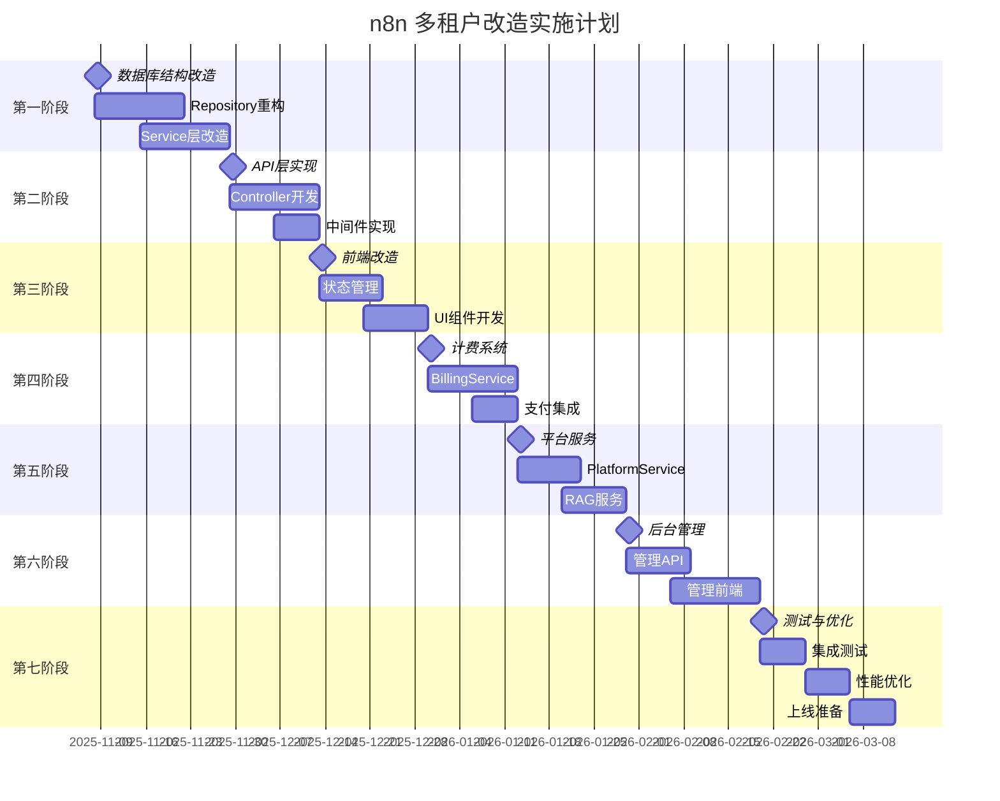

# n8n 多租户架构 - 实施计划与里程碑

> **配套文档：** 01-架构底层改造方案.md (v3.0), 04-安全与性能优化方案.md, 05-数据库初始化方案.md
> **版本：** v1.0
> **日期：** 2025-11-07
> **总工期：** 15-16周（约4个月）

---

## 📋 一、项目里程碑概览



---

## 二、详细实施计划

### 🏁 第一阶段：数据库与底层架构（Week 1-4）

**目标：** 完成数据库结构改造和Repository层重构

#### Week 1: 数据库结构改造

| 任务 | 负责人 | 预计工时 | 优先级 | 交付物 |
|------|--------|---------|--------|--------|
| 删除SharedWorkflow/SharedCredentials表 | DBA | 0.5天 | P0 | SQL脚本 |
| 创建TypeORM Migration | 后端 | 1天 | P0 | Migration文件 |
| 添加project_id字段 | 后端 | 0.5天 | P0 | Migration文件 |
| 创建计费系统表 | 后端 | 1天 | P0 | Migration文件 |
| 创建平台服务表 | 后端 | 0.5天 | P0 | Migration文件 |
| 执行数据库初始化 | DBA | 0.5天 | P0 | 验证报告 |
| 插入初始种子数据 | 后端 | 0.5天 | P1 | SQL脚本 |

**检查点：**
- ✅ 所有表结构正确创建
- ✅ 外键约束生效
- ✅ 索引创建成功
- ✅ 初始数据插入成功

#### Week 2-3: Repository层重构

| 任务 | 负责人 | 预计工时 | 优先级 | 交付物 |
|------|--------|---------|--------|--------|
| 删除SharedWorkflowRepository | 后端 | 0.5天 | P0 | 代码删除 |
| 删除SharedCredentialsRepository | 后端 | 0.5天 | P0 | 代码删除 |
| 重构WorkflowRepository | 后端 | 2天 | P0 | 新代码+测试 |
| 重构CredentialsRepository | 后端 | 2天 | P0 | 新代码+测试 |
| 创建WorkspaceBalanceRepository | 后端 | 1天 | P0 | 新代码+测试 |
| 创建UsageRecordRepository | 后端 | 1天 | P0 | 新代码+测试 |
| 创建PlatformServiceRepository | 后端 | 1天 | P0 | 新代码+测试 |
| 单元测试 | 后端 | 2天 | P0 | 测试覆盖率>80% |

**检查点：**
- ✅ 所有Repository单元测试通过
- ✅ 删除了所有SharedWorkflow/SharedCredentials引用
- ✅ 新Repository查询性能达标（<100ms）

#### Week 4: Service层改造（第一批）

| 任务 | 负责人 | 预计工时 | 优先级 | 交付物 |
|------|--------|---------|--------|--------|
| 创建WorkspaceContextService | 后端 | 2天 | P0 | 核心Service |
| 重构WorkflowService | 后端 | 2天 | P0 | 更新业务逻辑 |
| 重构CredentialsService | 后端 | 2天 | P0 | 更新业务逻辑 |
| 创建ProjectService（基础） | 后端 | 1天 | P0 | 工作空间管理 |
| 单元测试 | 后端 | 2天 | P0 | 测试覆盖率>80% |

**检查点：**
- ✅ WorkspaceContextService功能完整
- ✅ 工作流/凭证查询带工作空间隔离
- ✅ 所有单元测试通过

---

### 🚀 第二阶段：API层实现（Week 5-7）

**目标：** 完成Controller和中间件开发

#### Week 5-6: Controller开发

| 任务 | 负责人 | 预计工时 | 优先级 | 交付物 |
|------|--------|---------|--------|--------|
| 创建WorkspacesController | 后端 | 2天 | P0 | REST API |
| 更新WorkflowsController | 后端 | 2天 | P0 | 添加workspace上下文 |
| 更新CredentialsController | 后端 | 2天 | P0 | 添加workspace上下文 |
| 创建AuthController扩展 | 后端 | 1天 | P0 | 注册返回workspace |
| API集成测试 | 后端 | 2天 | P0 | Postman集合 |

**检查点：**
- ✅ 所有API端点正常工作
- ✅ API文档已更新（Swagger）
- ✅ Postman测试集合可用

#### Week 7: 中间件实现

| 任务 | 负责人 | 预计工时 | 优先级 | 交付物 |
|------|--------|---------|--------|--------|
| WorkspaceContextMiddleware | 后端 | 1天 | P0 | HTTP Header提取 |
| RateLimitMiddleware | 后端 | 2天 | P0 | Redis限流 |
| SecurityHeadersMiddleware | 后端 | 0.5天 | P1 | CSP/XSS防护 |
| 中间件集成测试 | 后端 | 1天 | P0 | 测试用例 |

**检查点：**
- ✅ 所有请求自动附加workspace上下文
- ✅ 限流功能正常（100req/min）
- ✅ 安全头部配置正确

#### Week 7-9: 企业版功能管理系统

**目标：** 实现企业版功能的三层管理架构

**Week 7: 数据库和后端API**

| 任务 | 负责人 | 预计工时 | 优先级 | 交付物 |
|------|--------|---------|--------|--------|
| 创建platform_feature_config表 | 后端 | 0.5天 | P0 | Migration文件 |
| 扩展user表（feature_preferences） | 后端 | 0.5天 | P0 | Migration文件 |
| 扩展project表（feature_config） | 后端 | 0.5天 | P0 | Migration文件 |
| 创建PlatformFeatureConfigRepository | 后端 | 0.5天 | P0 | Repository代码 |
| 创建AdminPlatformFeaturesController | 后端 | 2天 | P0 | API端点（3个） |
| 扩展WorkspacesController（功能配置） | 后端 | 1天 | P0 | API端点（5个） |
| 扩展UsersController（MFA+偏好） | 后端 | 2天 | P0 | API端点（4个） |
| 实现MFA Service | 后端 | 1天 | P1 | TOTP生成/验证 |

**检查点：**
- ✅ platform_feature_config表创建成功，初始化10条数据
- ✅ 所有API端点正常工作
- ✅ MFA流程完整（启用/验证/禁用）

**Week 8: 功能开关实施**

| 任务 | 负责人 | 预计工时 | 优先级 | 交付物 |
|------|--------|---------|--------|--------|
| 代码级禁用LDAP/SAML/OIDC | 后端 | 1天 | P0 | 条件检查代码 |
| 代码级禁用外部密钥管理 | 后端 | 0.5天 | P0 | 条件检查代码 |
| 代码级禁用日志流（用户侧） | 后端 | 0.5天 | P0 | 条件检查代码 |
| Worker View仅管理员可见 | 后端 | 0.5天 | P0 | 权限控制代码 |
| Public API限流中间件 | 后端 | 1天 | P0 | 基于workspace的限流 |
| 环境变量工作空间隔离验证 | 后端 | 0.5天 | P0 | 测试用例 |
| 审计日志工作空间隔离验证 | 后端 | 0.5天 | P0 | 测试用例 |
| 功能开关集成测试 | 后端 | 1天 | P0 | 完整测试集合 |

**检查点：**
- ✅ 被禁用功能无法通过API访问
- ✅ Public API限流验证（1000次/小时/workspace）
- ✅ 环境变量和审计日志完全隔离
- ✅ Worker View只有管理员能访问

**Week 9: 前端实现**

| 任务 | 负责人 | 预计工时 | 优先级 | 交付物 |
|------|--------|---------|--------|--------|
| 后台：PlatformFeaturesList.vue | 前端 | 2天 | P0 | 功能管理页面 |
| 后台：功能配置对话框 | 前端 | 1天 | P0 | API限流/历史保留配置 |
| 用户前端：WorkspaceSettings.vue | 前端 | 2天 | P0 | 工作空间设置页面 |
| 用户前端：环境变量管理Tab | 前端 | 1天 | P0 | 变量CRUD界面 |
| 用户前端：审计日志Tab | 前端 | 1天 | P0 | 日志查看界面 |
| 用户前端：PersonalSettings.vue | 前端 | 1天 | P0 | 个人设置页面 |
| 用户前端：MFA设置对话框 | 前端 | 1天 | P1 | 二维码+验证流程 |
| 用户前端：路由和导航更新 | 前端 | 0.5天 | P0 | 路由配置 |

**检查点：**
- ✅ 后台管理员可查看和配置所有功能
- ✅ 工作空间管理员可管理环境变量和审计日志
- ✅ 用户可启用/禁用MFA
- ✅ 所有UI与设计稿一致

---

### 🎨 第三阶段：前端改造（Week 8-10）

**目标：** 完成前端状态管理和UI组件开发

#### Week 8-9: 状态管理

| 任务 | 负责人 | 预计工时 | 优先级 | 交付物 |
|------|--------|---------|--------|--------|
| 创建ProjectsStore | 前端 | 2天 | P0 | Pinia Store |
| 更新WorkflowsStore | 前端 | 1天 | P0 | 添加workspace过滤 |
| 更新CredentialsStore | 前端 | 1天 | P0 | 添加workspace过滤 |
| Axios拦截器配置 | 前端 | 1天 | P0 | 自动附加Header |
| 状态管理单元测试 | 前端 | 2天 | P0 | Vitest测试 |

**检查点：**
- ✅ ProjectsStore管理所有工作空间
- ✅ 工作空间切换响应迅速
- ✅ 所有API请求自动带X-Workspace-Id

#### Week 10: UI组件开发

| 任务 | 负责人 | 预计工时 | 优先级 | 交付物 |
|------|--------|---------|--------|--------|
| WorkspaceSwitcher组件 | 前端 | 2天 | P0 | Vue组件 |
| WorkspaceSettingsView | 前端 | 2天 | P0 | 设置页面 |
| MemberManagementView | 前端 | 2天 | P0 | 成员管理 |
| 国际化文本 | 前端 | 1天 | P1 | i18n翻译 |
| 组件单元测试 | 前端 | 2天 | P0 | Vitest测试 |

**检查点：**
- ✅ 工作空间切换器功能完整
- ✅ 成员管理页面可用
- ✅ 所有文本已国际化

---

### 💰 第四阶段：计费系统（Week 11-13）

**目标：** 实现完整的计费功能

#### Week 11-12: BillingService

| 任务 | 负责人 | 预计工时 | 优先级 | 交付物 |
|------|--------|---------|--------|--------|
| 创建BillingService | 后端 | 3天 | P0 | 核心计费逻辑 |
| 实现悲观锁扣费 | 后端 | 1天 | P0 | 防余额透支 |
| 批量UsageRecord写入 | 后端 | 1天 | P1 | 性能优化 |
| 月度统计汇总 | 后端 | 1天 | P1 | Upsert实现 |
| 低余额告警 | 后端 | 1天 | P1 | 邮件/短信通知 |
| 单元测试 | 后端 | 2天 | P0 | 测试覆盖率>80% |

**检查点：**
- ✅ 余额扣费无并发问题
- ✅ 使用记录正确创建
- ✅ 低余额告警功能正常

#### Week 13: 支付集成

| 任务 | 负责人 | 预计工时 | 优先级 | 交付物 |
|------|--------|---------|--------|--------|
| 支付宝SDK集成 | 后端 | 2天 | P0 | 支付接口 |
| 微信支付SDK集成 | 后端 | 2天 | P1 | 支付接口 |
| 充值回调处理 | 后端 | 1天 | P0 | Webhook处理 |
| 前端充值页面 | 前端 | 1天 | P0 | RechargeView |
| 支付测试 | 全栈 | 1天 | P0 | 沙箱测试 |

**检查点：**
- ✅ 支付宝充值流程正常
- ✅ 充值回调正确更新余额
- ✅ 充值记录完整保存

---

### 🤖 第五阶段：平台服务（Week 14-16）

**目标：** 实现AI模型调用和RAG服务

#### Week 14-15: PlatformService

| 任务 | 负责人 | 预计工时 | 优先级 | 交付物 |
|------|--------|---------|--------|--------|
| 创建PlatformServiceService | 后端 | 2天 | P0 | 服务管理 |
| OpenAI API集成 | 后端 | 2天 | P0 | GPT调用 |
| Claude API集成 | 后端 | 1天 | P1 | Claude调用 |
| 计费集成（AI模型） | 后端 | 2天 | P0 | Token计费 |
| 前端AI节点更新 | 前端 | 2天 | P0 | 显示余额消耗 |
| 单元测试 | 后端 | 2天 | P0 | Mock API测试 |

**检查点：**
- ✅ AI模型调用成功
- ✅ Token消耗正确计费
- ✅ 前端显示费用信息

#### Week 16: RAG服务

| 任务 | 负责人 | 预计工时 | 优先级 | 交付物 |
|------|--------|---------|--------|--------|
| 创建PlatformRagService | 后端 | 2天 | P0 | RAG服务管理 |
| 向量数据库集成（Pinecone） | 后端 | 2天 | P0 | 向量搜索 |
| 法律知识库初始化 | AI工程师 | 2天 | P1 | 知识库数据 |
| RAG查询API | 后端 | 1天 | P0 | REST API |
| 前端RAG节点 | 前端 | 2天 | P1 | 新节点类型 |

**检查点：**
- ✅ RAG查询返回相关结果
- ✅ 按查询次数正确计费
- ✅ 前端RAG节点可用

---

### 🛠️ 第六阶段：后台管理系统（Week 17-20）

**目标：** 完成后台管理功能

#### Week 17-18: 管理API

| 任务 | 负责人 | 预计工时 | 优先级 | 交付物 |
|------|--------|---------|--------|--------|
| AdminAuthMiddleware | 后端 | 1天 | P0 | 管理员鉴权 |
| AdminPlatformServicesController | 后端 | 2天 | P0 | 服务管理API |
| AdminWorkspacesController | 后端 | 2天 | P0 | 工作空间管理API |
| AdminStatsController | 后端 | 2天 | P0 | 统计报表API |
| AdminLog记录 | 后端 | 1天 | P1 | 审计日志 |
| API测试 | 后端 | 2天 | P0 | Postman集合 |

**检查点：**
- ✅ 管理员权限验证正常
- ✅ 所有管理API可用
- ✅ 审计日志完整记录

#### Week 19-20: 管理前端

| 任务 | 负责人 | 预计工时 | 优先级 | 交付物 |
|------|--------|---------|--------|--------|
| 后台管理框架搭建 | 前端 | 2天 | P0 | Vue Router配置 |
| Dashboard统计面板 | 前端 | 3天 | P0 | 图表展示 |
| 平台服务管理页面 | 前端 | 2天 | P0 | CRUD操作 |
| 工作空间管理页面 | 前端 | 2天 | P0 | 搜索/充值 |
| 权限控制 | 前端 | 1天 | P0 | Route Guard |
| 单元测试 | 前端 | 2天 | P0 | E2E测试 |

**检查点：**
- ✅ 后台管理系统可访问
- ✅ 所有管理功能正常
- ✅ 统计数据准确展示

---

### 🧪 第七阶段：测试与优化（Week 21-23）

**目标：** 确保系统稳定性和性能

#### Week 21: 集成测试

| 任务 | 负责人 | 预计工时 | 优先级 | 交付物 |
|------|--------|---------|--------|--------|
| 用户注册流程测试 | QA | 1天 | P0 | 测试用例 |
| 工作空间管理测试 | QA | 1天 | P0 | 测试用例 |
| 工作流CRUD测试 | QA | 1天 | P0 | 测试用例 |
| 计费流程测试 | QA | 1天 | P0 | 测试用例 |
| 平台服务调用测试 | QA | 1天 | P0 | 测试用例 |
| 后台管理功能测试 | QA | 1天 | P0 | 测试用例 |
| Bug修复 | 全栈 | 3天 | P0 | Bug报告 |

**检查点：**
- ✅ 所有功能测试通过
- ✅ 关键Bug已修复
- ✅ 测试覆盖率>70%

#### Week 22: 性能优化

| 任务 | 负责人 | 预计工时 | 优先级 | 交付物 |
|------|--------|---------|--------|--------|
| 数据库慢查询优化 | 后端+DBA | 2天 | P0 | 索引优化 |
| Redis缓存实施 | 后端 | 2天 | P1 | 缓存策略 |
| 前端打包优化 | 前端 | 1天 | P1 | Code Splitting |
| 压力测试 | DevOps | 1天 | P0 | 性能报告 |
| 性能调优 | 全栈 | 1天 | P1 | 优化报告 |

**检查点：**
- ✅ API响应时间<100ms
- ✅ 支持1000并发用户
- ✅ 数据库查询<50ms

#### Week 23: 上线准备

| 任务 | 负责人 | 预计工时 | 优先级 | 交付物 |
|------|--------|---------|--------|--------|
| 生产环境部署配置 | DevOps | 2天 | P0 | 部署脚本 |
| Nginx配置 | DevOps | 1天 | P0 | Nginx配置文件 |
| SSL证书配置 | DevOps | 0.5天 | P0 | HTTPS启用 |
| 监控告警配置 | DevOps | 1天 | P0 | Prometheus |
| 备份策略 | DBA | 1天 | P0 | 自动备份脚本 |
| 上线演练 | 全员 | 1天 | P0 | 演练报告 |

**检查点：**
- ✅ 生产环境部署成功
- ✅ 监控告警正常
- ✅ 备份策略已启用

---

## 三、风险管理

### 3.1 技术风险

| 风险 | 可能性 | 影响 | 应对措施 | 负责人 |
|------|--------|------|---------|--------|
| 数据库性能瓶颈 | 中 | 高 | 提前性能测试，准备分库分表方案 | DBA |
| 并发扣费问题 | 低 | 高 | 使用悲观锁，充分测试 | 后端 |
| 前后端接口不一致 | 中 | 中 | API文档先行，接口评审 | 全栈 |
| 支付集成失败 | 低 | 高 | 使用沙箱环境充分测试 | 后端 |
| Redis缓存雪崩 | 低 | 中 | 缓存过期时间加随机值 | 后端 |

### 3.2 进度风险

| 风险 | 可能性 | 影响 | 应对措施 | 负责人 |
|------|--------|------|---------|--------|
| 人员不足 | 中 | 高 | 提前招聘/外包 | PM |
| 需求变更 | 高 | 中 | 敏捷开发，留出buffer时间 | PM |
| 技术难题 | 中 | 中 | 技术攻关，寻求外部支持 | 技术Leader |
| 测试时间不足 | 中 | 高 | 开发阶段同步测试 | QA |

---

## 四、资源需求

### 4.1 团队配置

| 角色 | 人数 | 投入度 | 关键技能 |
|------|------|--------|---------|
| **全栈工程师** | 2人 | 100% | TypeScript, Vue, Node.js |
| **后端工程师** | 1人 | 100% | TypeORM, PostgreSQL, Redis |
| **前端工程师** | 1人 | 100% | Vue 3, Pinia, TypeScript |
| **AI工程师** | 1人 | 50% | LangChain, 向量数据库 |
| **QA工程师** | 1人 | 80% | Jest, Playwright |
| **DevOps工程师** | 1人 | 50% | Docker, Nginx, 监控 |
| **DBA** | 1人 | 30% | PostgreSQL优化 |
| **产品经理** | 1人 | 50% | 需求管理 |

### 4.2 技术栈

**后端：**
- Node.js 20+
- TypeScript 5+
- Express 4+
- TypeORM 0.3+
- PostgreSQL 15+
- Redis 7+
- Jest

**前端：**
- Vue 3.4+
- Pinia
- Vite 5+
- Vitest

**基础设施：**
- Docker
- Nginx
- Prometheus + Grafana
- Sentry

### 4.3 外部服务

- OpenAI API
- Claude API
- Pinecone（向量数据库）
- 支付宝开放平台
- 微信支付
- 阿里云SMS（短信）
- 阿里云Email（邮件）

---

## 五、质量标准

### 5.1 代码质量

- ✅ TypeScript覆盖率 100%
- ✅ 单元测试覆盖率 >80%
- ✅ ESLint无错误
- ✅ Prettier格式统一
- ✅ Code Review通过率 100%

### 5.2 性能标准

- ✅ API响应时间 <100ms (p95)
- ✅ 数据库查询 <50ms
- ✅ 前端首屏加载 <2s
- ✅ 支持1000并发用户

### 5.3 安全标准

- ✅ SQL注入防护
- ✅ XSS防护
- ✅ CSRF防护（JWT）
- ✅ API限流
- ✅ 敏感数据加密

---

## 六、发布策略

### 6.1 灰度发布计划

| 阶段 | 用户范围 | 时间 | 观察指标 |
|------|---------|------|---------|
| **Alpha** | 内部团队 | Week 21 | 功能完整性 |
| **Beta** | 友好用户（10人） | Week 22 | 稳定性 |
| **正式发布** | 全量用户 | Week 23+ | 性能、稳定性 |

### 6.2 回滚策略

**触发条件：**
- 严重Bug影响核心功能
- 系统稳定性<99%
- 用户投诉激增

**回滚流程：**
```bash
# 1. 停止新版本服务
pm2 stop n8n-backend

# 2. 切换到旧版本
git checkout <previous-stable-commit>
pnpm build

# 3. 数据库回滚（如需要）
psql -U n8n -d n8n < rollback.sql

# 4. 重启服务
pm2 start n8n-backend

# 5. 监控验证
```

---

## 七、验收标准

### 7.1 功能验收

- [ ] 用户注册和登录
- [ ] 个人工作空间自动创建
- [ ] 团队工作空间创建和管理
- [ ] 工作空间成员邀请和权限管理
- [ ] 工作流CRUD（带工作空间隔离）
- [ ] 凭证CRUD（带工作空间隔离）
- [ ] 工作流执行（计费）
- [ ] AI模型调用（GPT-4, Claude）
- [ ] RAG服务查询（法律知识库）
- [ ] 余额充值（支付宝）
- [ ] 消费明细查看
- [ ] 后台管理系统完整功能

### 7.2 非功能验收

- [ ] API响应时间 <100ms
- [ ] 系统稳定性 >99.9%
- [ ] 代码覆盖率 >80%
- [ ] 安全扫描无高危漏洞
- [ ] 监控告警正常

---

## 八、里程碑总结

| 里程碑 | 完成时间 | 关键交付物 | 验收标准 |
|--------|---------|-----------|---------|
| **M1: 数据库与Repository** | Week 4 | 新数据库结构+Repository | 所有单元测试通过 |
| **M2: API层** | Week 7 | Controller+Middleware | API文档完整 |
| **M3: 前端** | Week 10 | 工作空间UI | 功能演示可用 |
| **M4: 计费系统** | Week 13 | BillingService+支付 | 支付流程正常 |
| **M5: 平台服务** | Week 16 | AI+RAG服务 | 服务调用成功 |
| **M6: 后台管理** | Week 20 | 管理系统 | 所有管理功能可用 |
| **M7: 上线** | Week 23 | 生产环境 | 系统稳定运行 |

---

**文档版本：** v1.0
**最后更新：** 2025-11-07
**项目经理：** [待填写]
**技术负责人：** [待填写]
